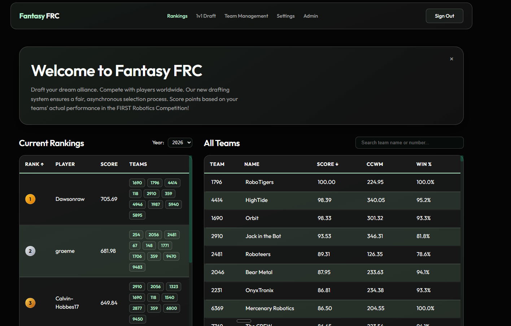
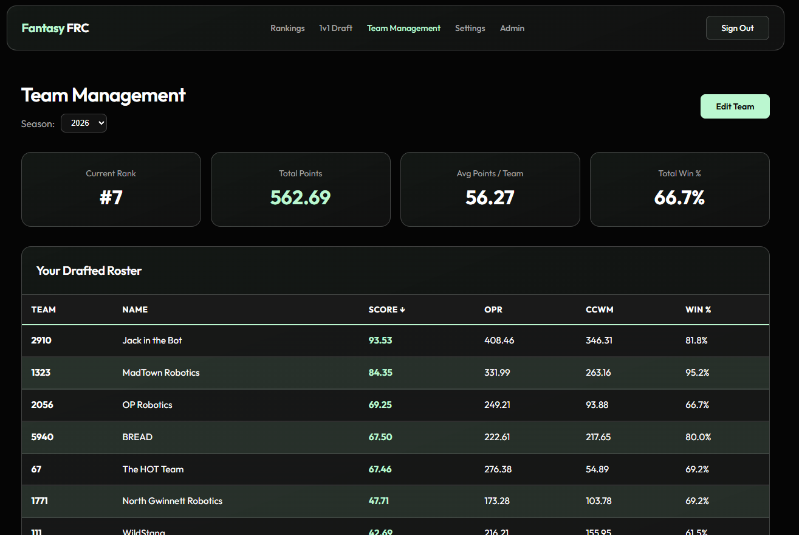
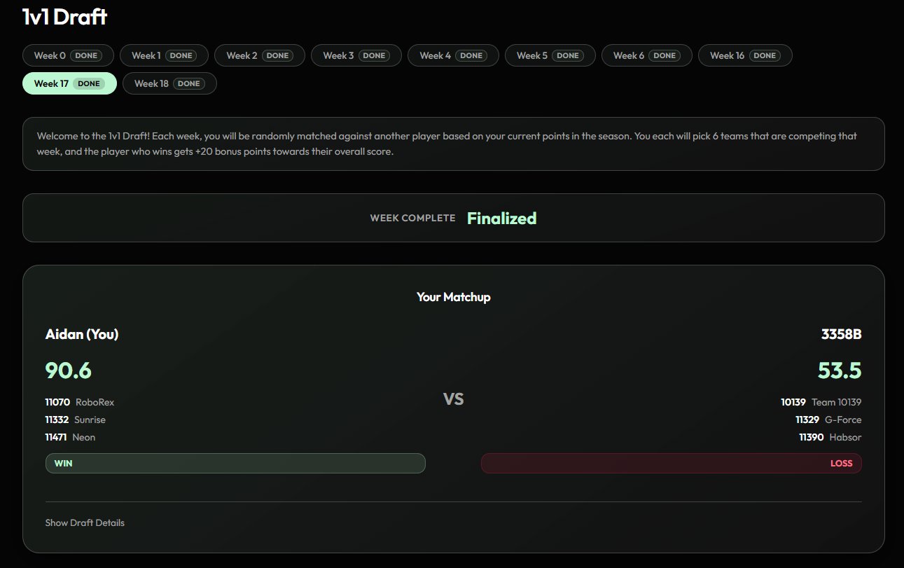

# Fantasy FRC

A fantasy app for FRC: draft teams, track performance, and score based on live data.

## Getting Started

### Prerequisites

### Install

```bash
git clone https://github.com/aidankeighron/fantasy-FRC.git
cd fantasy-FRC
npm install
cd functions && npm install && cd ..
```

### Configure Environment

Create `.env.local` in the project root:

```env
NEXT_PUBLIC_FIREBASE_API_KEY=
NEXT_PUBLIC_FIREBASE_AUTH_DOMAIN=
NEXT_PUBLIC_FIREBASE_PROJECT_ID=
NEXT_PUBLIC_FIREBASE_STORAGE_BUCKET=
NEXT_PUBLIC_FIREBASE_MESSAGING_SENDER_ID=
NEXT_PUBLIC_FIREBASE_APP_ID=
NEXT_PUBLIC_FIREBASE_MEASUREMENT_ID=
```

### Firebase Setup

```bash
firebase login
firebase deploy --only firestore:rules
firebase functions:secrets:set TBA_API_KEY
firebase deploy --only functions
```

### Run

```bash
npm run dev       # http://localhost:3000
npm run build     # production build
npm run start     # serve production build
```

### Deploy

Push to `main` — Firebase App Hosting deploys automatically.

```bash
firebase deploy --only functions   # update cloud functions
firebase deploy --only firestore   # update rules/indexes
```

## Screenshots

### Home



### Team



### 1 v 1


